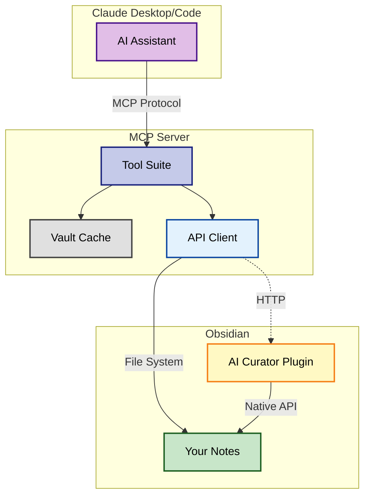

# Obsidian AI Curator Project Instructions

This document provides context for AI assistants and developers working on the Obsidian AI Curator project - an AI-powered system that actively manages and consolidates notes in an Obsidian vault.

## Project Vision
This project enables AI to be a true research partner and knowledge curator:
- **Active Curation**: AI proactively finds, consolidates, and organizes scattered knowledge
- **"Tetris for Knowledge"**: Like pieces falling into place, fragments combine into coherent notes
- **Research Partnership**: AI understands your research context and actively helps build knowledge

## How It Works



1. **MCP Server** provides tools for searching, reading, and writing notes
2. **Obsidian Plugin** adds native API access for better performance and accuracy
3. **AI Integration** enables Claude to understand vault structure and suggest improvements
4. **Git Integration** tracks changes and enables safe experimentation

## Key Components
1. **MCP Server** (`src/mcp-server.js`): Core tool interface for vault operations
2. **Obsidian Plugin** (`obsidian-ai-curator-plugin/`): API server and consolidation UI
3. **Tool Suite** (`src/tools/`): Specialized tools for search, write, tags, projects, etc.
4. **Obsidian API Client**: Auto-detects and uses plugin when available

## Development Guidelines
- Prefer TypeScript for plugin code
- Use ES modules for server-side code
- Always handle errors gracefully
- Maintain clean separation between Obsidian plugin and server components
- Ensure console output goes to stderr for MCP compatibility

## Core Capabilities

### 1. Intelligent Search & Discovery
- Find related notes across your vault
- Identify knowledge gaps and overlaps
- Suggest connections between ideas
- Execute complex metadata queries

### 2. Active Consolidation
- Detect scattered information on same topics
- Suggest note merges and reorganization
- Maintain proper links and references
- Archive consolidated fragments

### 3. Smart Organization
- Auto-tag based on content
- Maintain tag hierarchies
- Suggest better file organization
- Create project structures from templates

### 4. Research Partnership
- Understand your research context
- Proactively suggest next steps
- Track research progress
- Build knowledge systematically

## Technical Requirements
- Node.js 18+ required
- Vault path configured in `config/config.json` (user-specific, gitignored)
- Obsidian plugin API server runs on port 3001 (when enabled)
- Claude CLI required for AI consolidation features (optional)

## CRITICAL VAULT WRITE RULES
- **NEVER write files directly to the vault path** (e.g., using Write tool on /Users/*/obsidian/*)
- **ALWAYS use MCP server tools** for ALL vault operations:
  - Use `write_note` for creating/updating notes
  - Use `update_tags` or `update_frontmatter` for metadata changes
  - Use `append_to_daily_note` for daily notes
- **The MCP tools ensure**:
  - Proper tag validation and intelligence
  - Automatic date/timestamp management
  - Link formatting to wikilinks
  - Vault conventions are followed
- **Direct writes bypass ALL safeguards** and violate the project's core purpose

## Obsidian Conventions

### Internal Links
- **ALWAYS use wikilink format**: `[[Note Name]]` for internal links
- **DO NOT use markdown links with paths**: `[text](path/to/note.md)`
- **For aliases**: Use `[[Note Name|Display Text]]`
- **Examples**:
  - ✅ Correct: `[[AI Project Index]]`
  - ✅ Correct: `[[Meeting Notes 2024-01-15|Yesterday's Meeting]]`
  - ❌ Wrong: `[AI Project Index](Projects/AI Project Index.md)`
  - ❌ Wrong: `/Projects/AI Project Index.md`

### Tags
- **NEVER include `#` prefix in frontmatter tags** (Obsidian convention)
- **ONLY use `#` for inline tags** in the note body
- Use hierarchical tags when appropriate: `type/project-index` (in frontmatter)
- Follow vault's tag taxonomy
- **Critical**: Hashtags in frontmatter YAML are treated as comments and become `null`

#### Example Usage
```yaml
---
tags:
  - project/active
  - type/meeting
  - status/draft
---

# Meeting Notes

This is about the #project/active work.
Related tags: #type/meeting #important
```

## Working with the AI Curator

### As a Developer
- Run tests before committing changes
- Follow the TypeScript/ES module conventions
- Update documentation when adding features
- Use the TodoWrite tool to track complex tasks
- **Keep all examples and configurations generic** (no personal paths or data)
- **Use `nwant` for all GitHub repository references**
- **Write documentation from fresh developer perspective** - assume no prior knowledge
- **Use natural language examples** over code snippets when showing user interactions
- **Verify all setup instructions actually work** with fresh installs

### As a User
- Let the AI understand your research patterns
- Be specific about consolidation preferences
- Review AI suggestions before applying
- Use git checkpoints for major changes

### As an AI Assistant
- Proactively suggest improvements to vault organization
- Look for opportunities to consolidate related content
- Respect the user's existing structure and conventions
- Always use MCP tools, never direct file operations

## Privacy and Configuration Guidelines

### Repository Standards
1. **All configuration examples must be generic**:
   - Use `/path/to/your/vault` or `/Users/you/Documents/MyVault`
   - Never include actual personal vault paths
   - Use placeholder values for all examples

2. **Personal configurations are gitignored**:
   - `config/config.json` - User's actual configuration
   - `config/project-playbooks.json` - Custom playbooks
   - All files in `data/` except examples
   - Archive folders and personal notes

3. **Repository references use `nwant`**:
   - Clone URLs: `https://github.com/nwant/obsidian-ai-curator.git`
   - Issue tracker: `https://github.com/nwant/obsidian-ai-curator/issues`
   - Author attribution: `nwant`

### Configuration Best Practices
- Start with minimal config: just `vaultPath`
- Copy example files for customization:
  - `config.minimal.json` → `config.json`
  - `project-playbooks.example.json` → `project-playbooks.json`
- All personal customizations stay local and private

### When Contributing
- Never commit personal vault paths or data
- Test with generic example configurations
- Ensure all documentation uses placeholder values
- Keep repository URLs pointing to `nwant`

## Documentation Standards

### Writing Guidelines
1. **Clarity over completeness**: Be concise and direct
2. **Natural language examples**: Show how users actually interact with Claude
   - ✅ "Search for notes about machine learning"
   - ❌ `search_content({query: "machine learning"})`
3. **Step-by-step verification**: Include validation steps in setup guides
4. **Fresh developer perspective**: Assume no prior knowledge
5. **Remove redundancy**: Eliminate duplicate information across files

### Structure Principles
- **README**: Quick overview and minimal setup only
- **Quick Start**: Detailed setup with verification
- **Reference docs**: Comprehensive tool/config documentation
- **Examples**: Real-world use cases and workflows
- **Troubleshooting**: Problem/solution format

### Technical Accuracy
- **Test all paths**: Ensure file paths and commands actually exist
- **Absolute paths required**: MCP server needs absolute paths, not relative
- **Platform-specific**: Include macOS/Windows/Linux variations
- **Escape characters**: JSON strings need proper escaping (Windows paths: `\\\\`)
- **Validate scripts exist**: Don't reference npm scripts that don't exist
- **Check copy commands**: Ensure file copy instructions copy the right files

### Common Documentation Fixes Applied
- Converted JavaScript tool examples to natural language
- Simplified configuration with minimal vs advanced paths
- Added verification steps to setup process
- Removed redundant sections and complex diagrams from README
- Fixed Windows JSON path escaping issues
- Eliminated \"Ask Claude\"/\"Tell Claude\" inconsistency
- Removed reference to non-existent install scripts
- Standardized all GitHub references to use `nwant` username

## Test Implementation Roadmap

### Current State (December 2024)
The test suite has 159 unit test failures representing intended functionality that needs implementation. We've taken a pragmatic approach:
1. **Stub implementations** for missing methods to make tests pass
2. **Basic functionality** to ensure core operations work
3. **Gradual enhancement** over time to fulfill test expectations

### Methods Marked with @stub
These methods have basic implementations that need enhancement:

#### FrontmatterManager (`src/tools/frontmatter-manager.js`)
- `extractFrontmatter()` - Needs advanced parsing, error recovery
- `validateFrontmatter()` - Needs custom validation rules, type checking
- `formatFrontmatter()` - Needs template support, field transformations

#### PerformanceMonitor (`src/metrics/performance-monitor.js`)
- `startOperation()` / `endOperation()` - Needs distributed tracing
- `setThresholds()` / `checkThreshold()` - Needs alerting, auto-scaling
- `calculatePercentiles()` - Needs sliding window, outlier detection
- `getMemoryUsage()` - Needs trend analysis, leak detection
- `getSuccessRate()` - Needs categorization, root cause analysis

#### DailyNoteManager (`src/tools/daily-note-manager.js`)
- `formatTask()` - Needs Obsidian task plugin compatibility
- `extractTasks()` - Needs advanced parsing, recurring task support
- `appendToSection()` - Needs conflict resolution, template support

### Priority Implementation Order
1. **Critical Path** (Immediate)
   - Vault operations (read/write/scan)
   - Search functionality
   - Basic frontmatter handling

2. **Enhancement Phase** (Next Sprint)
   - Performance monitoring with real metrics
   - Advanced task management
   - Dataview query optimization

3. **Polish Phase** (Future)
   - Full test coverage for edge cases
   - Performance optimizations
   - Advanced features from test specs

### Testing Strategy
- Run individual test files to avoid timeout issues: 
  ```bash
  NODE_ENV=test NODE_OPTIONS=--experimental-vm-modules npx jest test/unit/[file].test.js --config jest.simple.config.js
  ```
- Focus on reducing failure count incrementally
- Document new implementations as they're added

### Known Issues
- Jest test suite hangs when running all tests together (use individual test runs)
- Some tests expect APIs that may differ from Obsidian plugin capabilities
- Performance tests need real-world calibration

## Common Pitfalls to Avoid

### Technical Issues
1. **Direct file writes**: Always use MCP tools, never Write/Edit tools on vault paths
2. **Relative paths in MCP config**: Must use absolute paths to mcp-server.js
3. **Missing restart instructions**: Users must restart Claude completely
4. **Tag formatting**: Remember - no hashtags in frontmatter YAML
5. **Breaking changes**: Test thoroughly with both plugin enabled and disabled

### Documentation Issues
6. **JavaScript examples for user interactions**: Users speak to Claude in natural language
7. **Redundant sections**: Don't repeat the same information in multiple places
8. **Missing verification**: Always include "how to test it works" steps
9. **Hardcoded paths**: All examples must use generic placeholders
10. **Personal information**: No real vault paths, usernames (except `nwant`), or personal data