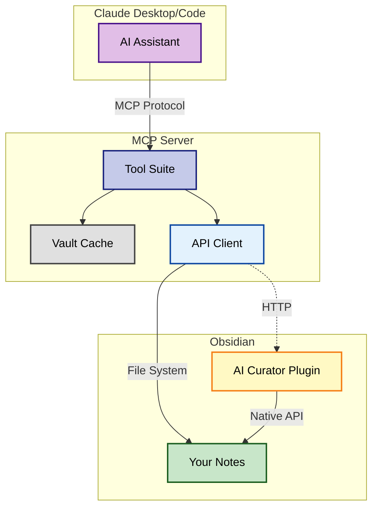

# Obsidian AI Curator Project Instructions

You are working on the Obsidian AI Curator project, an AI-powered system that actively manages and consolidates notes in an Obsidian vault.

## Project Vision
This project enables AI to be a true research partner and knowledge curator:
- **Active Curation**: AI proactively finds, consolidates, and organizes scattered knowledge
- **"Tetris for Knowledge"**: Like pieces falling into place, fragments combine into coherent notes
- **Research Partnership**: AI understands your research context and actively helps build knowledge

## How It Works



1. **MCP Server** provides tools for searching, reading, and writing notes
2. **Obsidian Plugin** adds native API access for better performance and accuracy
3. **AI Integration** enables Claude to understand vault structure and suggest improvements
4. **Git Integration** tracks changes and enables safe experimentation

## Key Components
1. **MCP Server** (`src/mcp-server.js`): Core tool interface for vault operations
2. **Obsidian Plugin** (`obsidian-ai-curator-plugin/`): API server and consolidation UI
3. **Tool Suite** (`src/tools/`): Specialized tools for search, write, tags, projects, etc.
4. **Obsidian API Client**: Auto-detects and uses plugin when available

## Development Guidelines
- Prefer TypeScript for plugin code
- Use ES modules for server-side code
- Always handle errors gracefully
- Maintain clean separation between Obsidian plugin and server components
- Ensure console output goes to stderr for MCP compatibility

## Core Capabilities

### 1. Intelligent Search & Discovery
- Find related notes across your vault
- Identify knowledge gaps and overlaps
- Suggest connections between ideas
- Execute complex metadata queries

### 2. Active Consolidation
- Detect scattered information on same topics
- Suggest note merges and reorganization
- Maintain proper links and references
- Archive consolidated fragments

### 3. Smart Organization
- Auto-tag based on content
- Maintain tag hierarchies
- Suggest better file organization
- Create project structures from templates

### 4. Research Partnership
- Understand your research context
- Proactively suggest next steps
- Track research progress
- Build knowledge systematically

## Important Notes
- The vault path is configured in `config/config.json`
- Obsidian API server runs on port 3001 by default
- Claude CLI must be installed and accessible in PATH for consolidation features

## CRITICAL VAULT WRITE RULES
- **NEVER write files directly to the vault path** (e.g., using Write tool on /Users/*/obsidian/*)
- **ALWAYS use MCP server tools** for ALL vault operations:
  - Use `write_note` for creating/updating notes
  - Use `update_tags` or `update_frontmatter` for metadata changes
  - Use `append_to_daily_note` for daily notes
- **The MCP tools ensure**:
  - Proper tag validation and intelligence
  - Automatic date/timestamp management
  - Link formatting to wikilinks
  - Vault conventions are followed
- **Direct writes bypass ALL safeguards** and violate the project's core purpose

## Obsidian Conventions

### Internal Links
- **ALWAYS use wikilink format**: `[[Note Name]]` for internal links
- **DO NOT use markdown links with paths**: `[text](path/to/note.md)`
- **For aliases**: Use `[[Note Name|Display Text]]`
- **Examples**:
  - ✅ Correct: `[[AI Project Index]]`
  - ✅ Correct: `[[Meeting Notes 2024-01-15|Yesterday's Meeting]]`
  - ❌ Wrong: `[AI Project Index](Projects/AI Project Index.md)`
  - ❌ Wrong: `/Projects/AI Project Index.md`

### Tags
- **NEVER include `#` prefix in frontmatter tags** (Obsidian convention)
- **ONLY use `#` for inline tags** in the note body
- Use hierarchical tags when appropriate: `type/project-index` (in frontmatter)
- Follow vault's tag taxonomy
- **Critical**: Hashtags in frontmatter YAML are treated as comments and become `null`

#### Example Usage
```yaml
---
tags:
  - project/active
  - type/meeting
  - status/draft
---

# Meeting Notes

This is about the #project/active work.
Related tags: #type/meeting #important
```

## Working with the AI Curator

### As a Developer
- Run tests before committing changes
- Follow the TypeScript/ES module conventions
- Update documentation when adding features
- Use the TodoWrite tool to track complex tasks

### As a User
- Let the AI understand your research patterns
- Be specific about consolidation preferences
- Review AI suggestions before applying
- Use git checkpoints for major changes

### As an AI Assistant
- Proactively suggest improvements to vault organization
- Look for opportunities to consolidate related content
- Respect the user's existing structure and conventions
- Always use MCP tools, never direct file operations