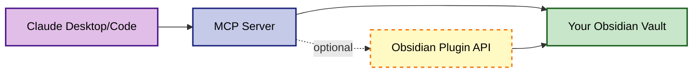

# Obsidian AI Curator

AI-powered tools for Obsidian that enable Claude Desktop and Claude Code to intelligently manage your knowledge vault through the Model Context Protocol (MCP).

## What You'll Get

After setup, you can ask Claude to:
- 🔍 "Search my vault for notes about machine learning"
- 📝 "Create a new project note with proper formatting"
- 🏷️ "Show me all notes tagged with #active that need review"
- 📁 "Organize my meeting notes from last week"
- 🔄 "Create a git checkpoint before making changes"

Claude will have direct access to read, write, and organize your Obsidian vault while following your formatting rules.

## What It Does

- **Smart Search & Read**: Find and read notes with content search, metadata queries, and Dataview support
- **Intelligent Writing**: Create and update notes with automatic link formatting, tag validation, and frontmatter handling  
- **Project Management**: Initialize standardized project structures with customizable templates
- **File Operations**: Rename, move, and organize files with automatic link preservation
- **Tag Management**: Analyze, suggest, and rename tags across your entire vault
- **Git Integration**: Create checkpoints and rollback changes
- **Daily Notes**: Manage daily notes with templates and quick capture

## Quick Start

### 1. Install MCP Server

```bash
git clone https://github.com/nwant/obsidian-ai-curator.git
cd obsidian-ai-curator
npm install
```

### 2. Configure

```bash
cp config/config.example.json config/config.json
# Edit config/config.json with your vault path
```

### 3. Add to Claude Desktop

Edit your Claude Desktop config:
- macOS: `~/Library/Application Support/Claude/claude_desktop_config.json`
- Windows: `%APPDATA%\Claude\claude_desktop_config.json`
- Linux: `~/.config/Claude/claude_desktop_config.json`

```json
{
  "mcpServers": {
    "obsidian-vault": {
      "command": "node",
      "args": ["/path/to/obsidian-ai-curator/src/mcp-server.js"]
    }
  }
}
```

### 4. Restart Claude Desktop

Completely quit and restart Claude Desktop to load the MCP server.

### 5. (Optional) Install Obsidian Plugin

For enhanced performance, install the companion plugin:

```bash
cd obsidian-ai-curator-plugin
npm install && npm run build
# Copy built files to your vault:
mkdir -p /path/to/YourVault/.obsidian/plugins/obsidian-ai-curator
cp main.js manifest.json main.css /path/to/YourVault/.obsidian/plugins/obsidian-ai-curator/
```

See [Quick Start Guide](docs/QUICK_START.md) for detailed setup instructions.

## Key Features

### 🔍 Intelligent Search

Ask Claude to search your vault:
- "Find all notes about project planning"
- "Show me active projects with high priority"
- "Search for notes tagged with #project created this year"

Claude will use these MCP tools automatically:
- `search_content` - Full text search
- `find_by_metadata` - Search by frontmatter fields
- `query_dataview` - Execute Dataview queries

### 📝 Smart Writing

Ask Claude to create and manage notes:
- "Create a new project note called 'AI Assistant'"
- "Add tags #active and #high-priority to my meeting notes"
- "Update the status of Project X to completed"

Features:
- Automatic link formatting (`[[wikilinks]]`)
- Tag validation and hierarchy
- Consistent frontmatter structure

### 🗂️ Project Templates

Ask Claude to set up project structures:
- "Create a new project for mobile app development"
- "Set up a research project about machine learning"
- "Initialize a project with custom template"

Create your own templates in `config/project-templates.json`

See [Examples](docs/EXAMPLES.md) for more use cases.

## Documentation

- [Quick Start Guide](docs/QUICK_START.md) - Get running in 5 minutes
- [Troubleshooting](docs/TROUBLESHOOTING.md) - Common issues and solutions
- [Configuration Guide](docs/CONFIGURATION.md) - All configuration options
- [MCP Tools Reference](docs/MCP_TOOLS.md) - Complete tool API documentation  
- [Examples](docs/EXAMPLES.md) - Common use cases and workflows
- [Project Templates](docs/PROJECT_TEMPLATES.md) - Creating custom project templates
- [Obsidian Plugin Guide](docs/OBSIDIAN_PLUGIN.md) - Plugin features and setup
- [Formatting Rules](docs/FORMATTING_RULES.md) - Important Obsidian formatting guidelines

## Architecture



The MCP server can work standalone or use the Obsidian plugin for enhanced performance and native API access.

## Requirements

- Node.js 18+
- Obsidian (for vault)
- Claude Desktop or Claude Code
- Git (optional, for version control features)

## Common Issues

**"Claude doesn't see the MCP tools"**
- Did you restart Claude completely after editing the config?
- Is the path to `mcp-server.js` absolute in your Claude config?

**"Permission denied" errors**
- Check that your vault path in `config.json` is correct
- Ensure you have read/write permissions to your vault

**"Cannot find module" errors**
- Run `npm install` in the project directory
- Make sure you're using Node.js 18 or higher

See [Troubleshooting Guide](docs/QUICK_START.md#troubleshooting) for more help.

## Contributing

Contributions welcome! Please read our [contributing guidelines](CONTRIBUTING.md) before submitting PRs.

## License

MIT