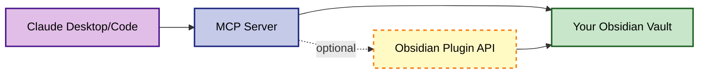

# Obsidian AI Curator

AI-powered tools for Obsidian that enable Claude Desktop and Claude Code to intelligently manage your knowledge vault through the Model Context Protocol (MCP).

## What It Does

- **Smart Search & Read**: Find and read notes with content search, metadata queries, and Dataview support
- **Intelligent Writing**: Create and update notes with automatic link formatting, tag validation, and frontmatter handling  
- **Project Management**: Initialize standardized project structures with customizable templates
- **File Operations**: Rename, move, and organize files with automatic link preservation
- **Tag Management**: Analyze, suggest, and rename tags across your entire vault
- **Git Integration**: Create checkpoints and rollback changes
- **Daily Notes**: Manage daily notes with templates and quick capture

## Quick Start

### 1. Install MCP Server

```bash
git clone https://github.com/nwant/obsidian-ai-curator.git
cd obsidian-ai-curator
npm install
```

### 2. Configure

```bash
cp config/config.example.json config/config.json
# Edit config/config.json with your vault path
```

### 3. Add to Claude Desktop

Edit `~/Library/Application Support/Claude/claude_desktop_config.json`:

```json
{
  "mcpServers": {
    "obsidian-vault": {
      "command": "node",
      "args": ["/path/to/obsidian-ai-curator/src/mcp-server.js"]
    }
  }
}
```

### 4. (Optional) Install Obsidian Plugin

For enhanced performance, install the companion plugin:

```bash
cd obsidian-ai-curator-plugin
npm install && npm run build
# Copy to: YourVault/.obsidian/plugins/obsidian-ai-curator/
```

See [Quick Start Guide](docs/QUICK_START.md) for detailed setup instructions.

## Key Features

### 🔍 Intelligent Search
```javascript
// Find notes by content
search_content({ query: "project planning" })

// Query by metadata  
find_by_metadata({ 
  frontmatter: { status: "active", priority: { "$gte": 3 } }
})

// Execute Dataview queries
query_dataview({ 
  query: "TABLE status FROM #project WHERE date >= date(2024-01-01)" 
})
```

### 📝 Smart Writing
```javascript
// Create notes with automatic formatting
write_note({
  path: "Projects/New Idea.md",
  content: "# New Idea\n\nLink to [[Existing Note]] automatically formatted!"
})

// Update tags intelligently
update_tags({
  path: "Notes/Meeting.md",
  add: ["status/active", "type/meeting"]
})
```

### 🗂️ Project Templates
```javascript
// Initialize projects with templates
init_project({
  projectName: "AI Assistant",
  description: "Building a helpful AI",
  template: "default"
})

// Create custom templates in config/project-templates.json
```

See [Examples](docs/EXAMPLES.md) for more use cases.

## Documentation

- [Quick Start Guide](docs/QUICK_START.md) - Get running in 5 minutes
- [Configuration Guide](docs/CONFIGURATION.md) - All configuration options
- [MCP Tools Reference](docs/MCP_TOOLS.md) - Complete tool API documentation  
- [Examples](docs/EXAMPLES.md) - Common use cases and workflows
- [Project Templates](docs/PROJECT_TEMPLATES.md) - Creating custom project templates
- [Obsidian Plugin Guide](docs/OBSIDIAN_PLUGIN.md) - Plugin features and setup
- [Formatting Rules](docs/FORMATTING_RULES.md) - Important Obsidian formatting guidelines

## Architecture



The MCP server can work standalone or use the Obsidian plugin for enhanced performance and native API access.

## Requirements

- Node.js 18+
- Obsidian (for vault)
- Claude Desktop or Claude Code
- Git (optional, for version control features)

## Contributing

Contributions welcome! Please read our [contributing guidelines](CONTRIBUTING.md) before submitting PRs.

## License

MIT