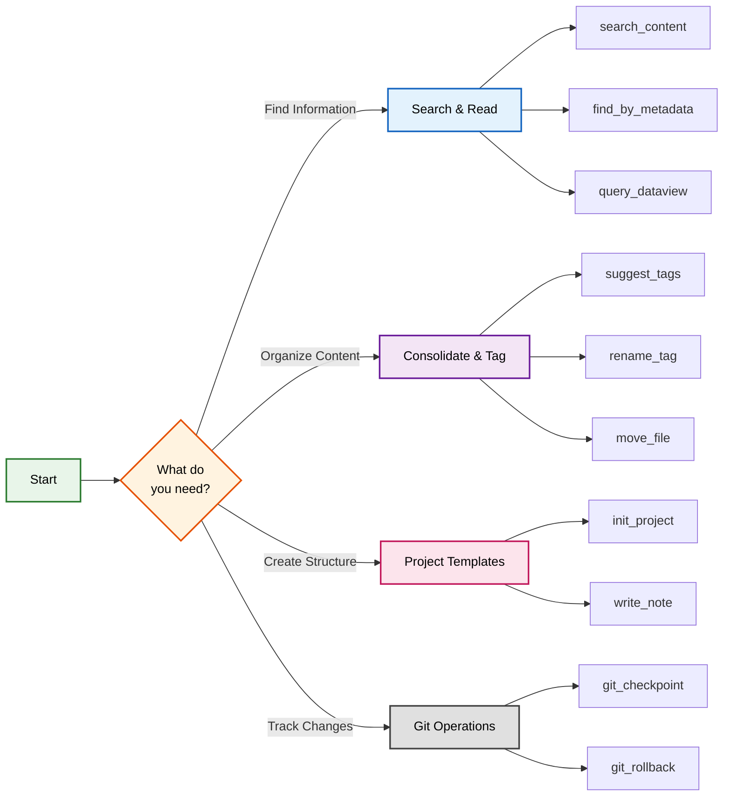

# Examples & Use Cases

Common scenarios and example commands for Obsidian AI Curator.

## Typical Workflow



## Daily Workflow

### Morning Review
```javascript
// Get today's daily note
get_daily_note({ date: "today" })

// Find recent active projects
find_by_metadata({
  frontmatter: { 
    status: "active",
    modified: { "$gte": "2024-01-10" }
  }
})

// Check tasks across vault
search_content({ query: "- [ ]" })
```

### Quick Capture
```javascript
// Add to daily note
append_to_daily_note({
  content: "Meeting with Sarah - discussed API design",
  section: "Notes"
})

// Create quick note
write_note({
  path: "Inbox/Quick Idea.md",
  content: "# Quick Idea\n\nWhat if we..."
})
```

## Project Management

### Starting a New Project
```javascript
// Initialize with template
init_project({
  projectName: "Mobile App Redesign",
  description: "Redesigning our mobile app for better UX",
  projectType: "software",
  stakeholders: ["Sarah (Designer)", "Mike (PM)", "Alex (Dev)"],
  targetDate: "2024-06-30",
  template: "default"
})

// Find similar projects for reference
search_content({ 
  query: "mobile app UX design",
  maxResults: 10
})
```

### Project Status Review
```javascript
// Find all active projects
find_by_metadata({
  frontmatter: {
    type: "project",
    status: "active"
  }
})

// Check project health (overdue items)
find_by_metadata({
  frontmatter: {
    targetDate: { "$lt": "2024-01-15" },
    status: { "$not": "completed" }
  }
})
```

## Knowledge Management

### Research Collection
```javascript
// Find notes on a topic
search_content({
  query: "machine learning transformers",
  contextLines: 3
})

// Find by multiple tags
find_by_metadata({
  frontmatter: {
    tags: { "$in": ["ai", "ml", "deep-learning"] }
  }
})

// Get research context
get_working_context({
  scope: "topic",
  identifier: "machine learning",
  maxNotes: 20
})
```

### Content Organization
```javascript
// Find orphaned notes (no tags)
find_by_metadata({
  frontmatter: {
    tags: { "$empty": true }
  }
})

// Find stubs (short notes)
find_by_metadata({
  minWords: 0,
  maxWords: 50
})

// Archive old completed projects
archive_notes({
  moves: [
    { from: "Projects/Q3 Campaign.md", to: "Archive/2023/Q3 Campaign.md" },
    { from: "Projects/Website Update.md", to: "Archive/2023/Website Update.md" }
  ]
})
```

## Tag Management

### Tag Cleanup
```javascript
// Analyze tag usage
analyze_tags()

// Fix typo in tags
rename_tag({
  oldTag: "programming-old",
  newTag: "programming",
  preview: true  // Preview first
})

// Consolidate similar tags
rename_tag({
  oldTag: "ai-ml",
  newTag: "ai/machine-learning"
})
```

### Smart Tagging
```javascript
// Get suggestions for content
suggest_tags({
  content: "This article discusses Python async/await patterns and performance optimization",
  existingTags: ["programming"]
})

// Bulk update tags
update_tags({
  path: "Notes/Python Async.md",
  add: ["python", "async", "performance"],
  remove: ["draft"]
})
```

## Advanced Queries

### Complex Metadata Searches
```javascript
// Find high-priority incomplete items
find_by_metadata({
  frontmatter: {
    priority: { "$gte": 4 },
    status: { "$not": "completed" },
    assigned: { "$exists": true }
  }
})

// Find notes needing review (old + unmodified)
find_by_metadata({
  frontmatter: {
    created: { "$lt": "2023-01-01" },
    reviewed: { "$exists": false }
  },
  modifiedBefore: "2023-06-01"
})
```

### Dataview Integration
```javascript
// Project dashboard
query_dataview({
  query: `
    TABLE status, priority, targetDate
    FROM #project
    WHERE status != "completed"
    SORT priority DESC
  `
})

// Weekly review
query_dataview({
  query: `
    LIST
    FROM "Daily"
    WHERE file.ctime >= date(today) - dur(7 days)
    SORT file.name DESC
  `
})
```

## Maintenance Tasks

### Link Management
```javascript
// Rename file with link updates
rename_file({
  oldPath: "Notes/Untitled.md",
  newPath: "Notes/API Design Patterns.md"
})

// Move to proper location
move_file({
  sourcePath: "Inbox/Meeting Notes.md",
  targetPath: "Meetings/2024-01-15 Team Sync.md"
})
```

### Version Control
```javascript
// Checkpoint before major changes
git_checkpoint({
  message: "Before restructuring project folders"
})

// Check what changed
git_changes({ since: "HEAD~5" })

// Rollback if needed
git_rollback({ commit: "abc123" })
```

## Natural Language Usage

When using with Claude, you can use natural language:

- "Find all my active projects"
- "Show me notes I wrote about Python last week"
- "Create a new project for the mobile app redesign"
- "Add a task to today's daily note about reviewing PRs"
- "Rename the 'todo' tag to 'task' everywhere"
- "Find notes that mention machine learning but aren't tagged properly"

Claude will translate these to appropriate tool calls automatically.