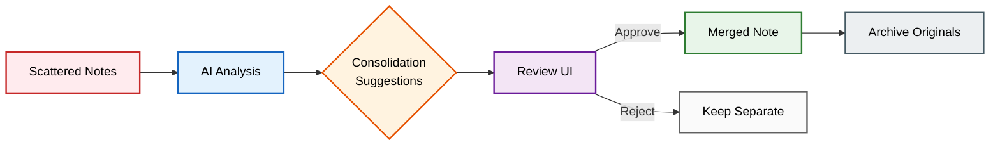
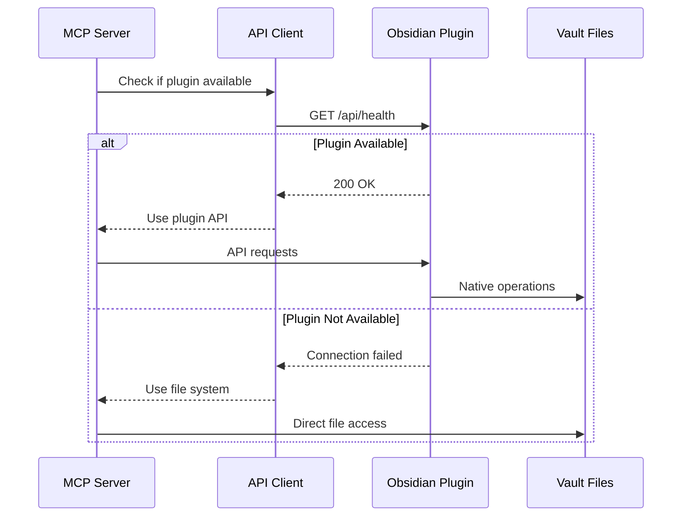

# Obsidian Plugin Guide

The Obsidian AI Curator plugin provides enhanced performance and native API access for MCP operations.

## Installation

### 1. Build the Plugin

```bash
cd obsidian-ai-curator-plugin
npm install
npm run build
```

### 2. Install in Obsidian

#### Option 1: Development Setup (Recommended)
```bash
# Create symbolic link for development
ln -s "$(pwd)" /path/to/vault/.obsidian/plugins/obsidian-ai-curator
```

#### Option 2: Manual Installation
```bash
# Create plugin directory
mkdir -p /path/to/vault/.obsidian/plugins/obsidian-ai-curator

# Copy plugin files
cp main.js manifest.json styles.css /path/to/vault/.obsidian/plugins/obsidian-ai-curator/
```

#### Option 3: Using the Install Script
```bash
npm run install-plugin -- /path/to/vault
```

### 3. Enable the Plugin

1. Open Obsidian Settings
2. Go to Community Plugins
3. Disable Safe Mode if needed
4. Find "Obsidian AI Curator" and enable it

## Features

### API Server

The plugin runs an API server on port 3001 that provides:

- **Native Link Resolution**: Proper handling of aliases and relative links
- **Cached Metadata**: Fast access to frontmatter and tags
- **File Operations**: Safe rename/move with automatic link updates
- **Search Index**: Access to Obsidian's search capabilities

### Performance Benefits

With plugin enabled:
- Vault scans: ~10x faster
- Metadata queries: ~5x faster  
- Link operations: 100% accurate
- No file system watching needed

### Consolidation UI

Access via Command Palette: "AI Curator: Show Consolidation View"



Features:
- Find related notes for consolidation
- Preview merge results
- One-click consolidation
- Automatic archiving

## Configuration

Plugin settings available in Obsidian:

- **API Port**: Default 3001
- **Auto-start API**: Enable/disable automatic API startup
- **Debug Mode**: Show detailed logs in console

## Troubleshooting

### Plugin Not Loading

1. Check Obsidian console (Ctrl/Cmd + Shift + I)
2. Verify files copied correctly
3. Try reloading Obsidian

### API Connection Issues

1. Check if port 3001 is available
2. Verify firewall settings
3. Check console for error messages

### Performance Issues

1. Disable debug mode
2. Check vault size (large vaults may need optimization)
3. Ensure no other plugins conflict

## How It Works



The MCP server automatically detects and uses the plugin API when available, falling back to direct file system access if not.

## API Endpoints

The plugin exposes these endpoints:

- `GET /api/resolve-link` - Resolve wikilinks to file paths
- `GET /api/metadata/:path` - Get cached metadata for a file
- `POST /api/rename` - Rename file with link updates
- `POST /api/move` - Move file with link updates
- `GET /api/search` - Search using Obsidian's index
- `GET /api/tags` - All tags from metadata cache
- `GET /api/links` - Outgoing links from any note
- `GET /api/backlinks` - Incoming links to any note
- `GET /api/swagger` - API documentation

## Development

### Building from Source

```bash
# Development build with watching
npm run dev

# Production build
npm run build

# Run tests
npm test
```

### Contributing

1. Fork the repository
2. Create your feature branch
3. Make changes and test thoroughly
4. Submit a pull request

## Claude CLI Integration

The plugin includes Claude CLI integration for AI-powered note consolidation:

### Using Claude CLI
1. **Ensure Claude Code is installed**:
   ```bash
   claude --version
   ```

2. **Use consolidation features**:
   - Command Palette: "AI Curator: Find notes to consolidate"
   - Reviews vault and suggests consolidations
   - No API key required - uses your Claude subscription

### Claude CLI Benefits
- ✅ No API key required
- ✅ Uses your Claude subscription
- ✅ Full access to MCP tools
- ✅ Streaming progress updates

## FAQ

**Q: Is the plugin required?**
A: No, the MCP server works without it, but the plugin provides better performance and accuracy.

**Q: Does it work with Obsidian Sync?**
A: Yes, all operations are done through Obsidian's API, so sync works normally.

**Q: Can I change the API port?**
A: Yes, in plugin settings. Update your MCP server config to match.

**Q: Is it safe?**
A: The plugin only exposes read/write operations on your vault, not system access.

**Q: Claude CLI not working?**
A: Check that `claude` is in your PATH or set the full path in plugin settings.